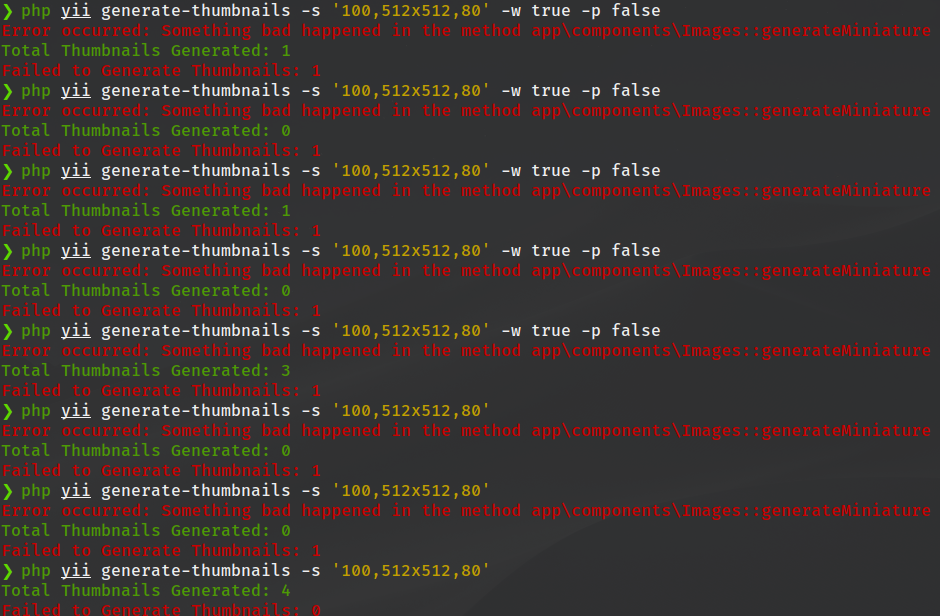

Реализация тестового задания

# Создать команду для генерации миниатюр

### Окружение

* `PHP 8.*`
* `Yii 2.*`
* `MySQL 8.*`

## Условия

В системе есть таблицы `product` и `store_product`. В таблице `product` есть поля:
* `id`
* `image`
* `is_deleted`

A в таблице `store_product` есть поля:
* `id`
* `product_id`
* `product_image`

Связь между ними: `product.id = store_product.product_id`. Также в системе имеется класс `Images`, который умеет генерировать миниатюры. У класса есть два статичных публичных метода:
`generateMiniature()` и `generateWatermarkedMiniature()`. Оба принимают на вход следующие параметры:

1. Ссылку на картинку
2. Массив, в котором указана максимальная ширина и высота миниатюры в ключах `width` и `height` (пример: `['width'=>500, 'height'=>400]`)

В ответ либо возвращают ссылку на миниатюру, либо выбрасывают исключение. Класс в полноценном виде реализовывать не нужно, достаточно функций-заглушек.
Можно использовать этот пример:

```php
<?php

namespace app\components;

use RuntimeException;

class Images
{
    public static function generateMiniature(string $link, array $size): string
    {
        $isSuccess = rand(0, 1);

        if (!$isSuccess) {
            throw new RuntimeException('Something bad happened in the method ' . __METHOD__);
        }


        return $link . '-miniature';
    }

    public static function generateWatermarkedMiniature(string $link, array $size): string
    {
        return self::generateMiniature($link, $size) . '-watermarked';
    }
}
```
## Описание

Необходимо, чтобы по команде `yii <some-command>` генерировались миниатюры для изображений для всех продуктов, которые не удалены. Команда должна принимать три именованных параметра:
1. `sizes` - обязательный, набор размеров миниатюр. Размеры разделяются через запятую. Если ширина и высота разная, то они разделяются символом `x` (латиница).
Пример формата: `100,200x300,500x600`.
2. `watermarked` - опциональный, по умолчанию `false`. Накладывать ли водные знаки на миниатюру.
3. `publishedOnly` - опциональный, по умолчанию `true`. Искать только те товары, которые есть в обеих таблицах - "product" и "store_product"

Миниатюры должны генерироваться как для `product.image`, так и для `store_product.product_image`. Учесть, что как `product.image`, так и `store_product.image` могут быть `NULL`.
Сохранять данные нигде не надо.
На выходе система должна выдать сообщение о том, сколько миниатюр было сгенерировано успешно и сколько сгенерировать не удалось.

### Результат выполнения консольной команды



## Как развернуть проект

1. Клонировать репозиторий: `git@github.com:yaleksandr89/yii2-test-task.git`
2. Создать БД
3. Переименовать `config/db.php.example` -> `config/db.php` и `config/params.php.example` в `config/params.php`. Отредактировать данные файлы, как минимум настроить подключение к БД, изменение в файл с параметрами можно не вносить.
4. Выполнить миграции: `php yii migrate`. Создадутся таблицы с тестовыми данными.
5. В консоли выполнить:
   * Использование алиасов вместо указания полного названия параметра: `php yii generate-thumbnails -s '100,512x512,80'`
   * Указание полного названия параметра: `php yii generate-thumbnails --size='100,512x512,80'`

Так же в команде присутствуют ещё два параметра со значениями по умолчанию (их названия и описание приведены в разделе "Описание"). Выполнение 
консольной команды с использованием всех параметров:

* Использование алиасов вместо указания полного названия параметров: `php yii generate-thumbnails -s '100,512x512,80' -w false -p false`
* Указание полного названия параметров: `php yii generate-thumbnails --size='100,512x512,80' --watermarked=false --publishedOnly=false`